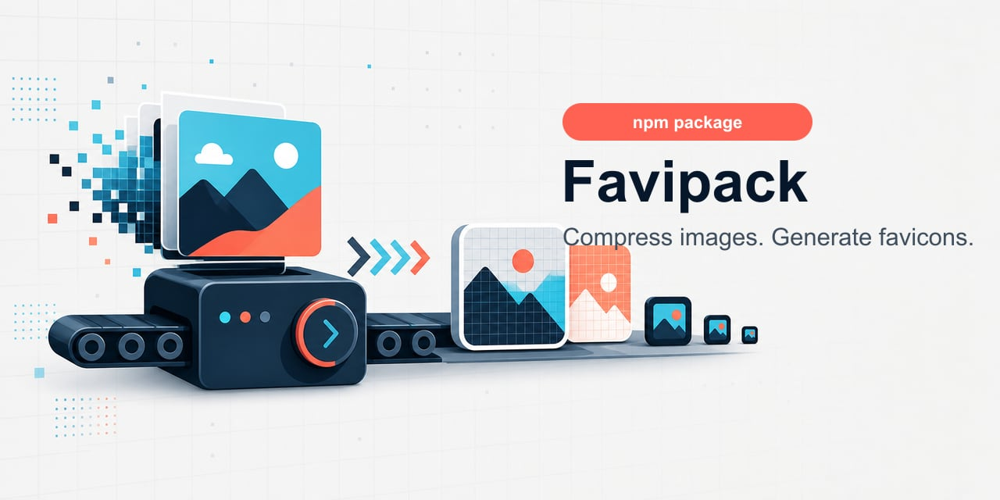

# Favipack



Favipack is a small Node/TypeScript package for common website image chores:

- compress and convert PNG, JPEG, WebP, and AVIF images
- generate `.ico` favicons from PNG or JPEG inputs
- generate full website favicon packs with PNG icons and `site.webmanifest`

It uses Sharp for decode, resize, and image compression. ICO writing is first-party code: Favipack writes the `ICONDIR`, directory entries, PNG-backed ICO entries, and optional BMP/DIB entries itself.

## Install

```sh
npm install favipack
```

## API

```ts
import { compressFile, compressImage, createFavicon, createFaviconPack, createIco } from "favipack";

await compressFile("public/photo.jpg", "public/photo.min.jpg", {
  quality: 78,
  resize: { width: 1600, fit: "inside" }
});

const compressed = await compressImage(await fs.promises.readFile("logo.png"), {
  format: "png",
  png: { palette: true }
});

await createFavicon("public/logo.png", "public/favicon.ico", {
  sizes: [16, 32, 48, 256],
  format: "auto",
  fit: "contain"
});

await createFaviconPack("public/logo.png", "public", {
  appName: "My Site",
  shortName: "Site",
  themeColor: "#ffffff"
});

const ico = await createIco("public/logo.jpg", {
  sizes: [16, 32, 48],
  format: "bmp"
});
```

## CLI

```sh
favipack compress input.jpg output.jpg --quality 80 --max-width 1600
favipack compress input.png output.png --png-palette
favipack compress hero.jpg hero.webp --format webp --quality 80
favipack compress hero.jpg hero.avif --format avif --quality 55
favipack compress "public/**/*.{jpg,png}" --out-dir public/optimized --format webp --quality 80
favipack favicon logo.png favicon.ico --sizes 16,32,48,256
favipack favicon logo.jpg favicon.ico --ico-format bmp
favipack pack logo.png public --app-name "My Site" --theme-color "#ffffff"
favipack --version
```

Compression commands print size stats:

```text
photo.jpg -> photo.min.jpg (1.8 MB -> 412.0 KB, 77.6% saved)
```

## Favicon Packs

`favipack pack` writes a complete website favicon bundle:

```text
favicon.ico
favicon-16x16.png
favicon-32x32.png
apple-touch-icon.png
android-chrome-192x192.png
android-chrome-512x512.png
site.webmanifest
```

Manifest fields can be customized with `--app-name`, `--short-name`, `--theme-color`, `--background-color`, `--display`, and `--path-prefix`.

## Assets

The package includes optimized artwork generated for Favipack:

- `assets/favipack-banner.jpg`
- `assets/favipack-logo.png`
- `assets/favipack-icon-256.png`
- `assets/favicon.ico`

The larger generation sources live in `assets/source` locally and are not included in the npm package tarball.

## Dependency Choice

Sharp is the default compression engine because it is current, typed, fast, and backed by libvips. As of the May 2026 package check, Sharp is at `0.34.5`, ships TypeScript declarations, supports Node-API v9 runtimes, and provides prebuilt binaries for common macOS, Linux, Windows, and WASM targets.

Alternatives considered:

- `imagemin` is lightweight at the wrapper level, but the best JPEG/PNG results typically come from plugin binaries such as `imagemin-mozjpeg` and `imagemin-pngquant`; that adds more moving pieces.
- `@squoosh/lib` is large and still positioned as experimental.
- `@jsquash/oxipng` is attractive for browser/WASM PNG optimization, but it only solves PNG and requires WASM asset handling.

## ICO Notes

The default ICO mode is `auto`: `16`, `32`, and `48` are written as 32-bit BGRA DIB entries with a 1-bit AND mask, while `256` is written as a PNG-compressed entry. You can force `format: "png"` for smaller files or `format: "bmp"` for all-DIB output.
